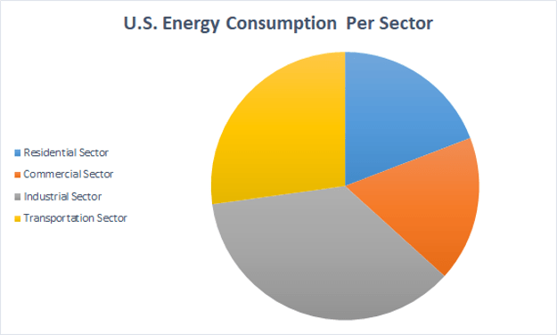
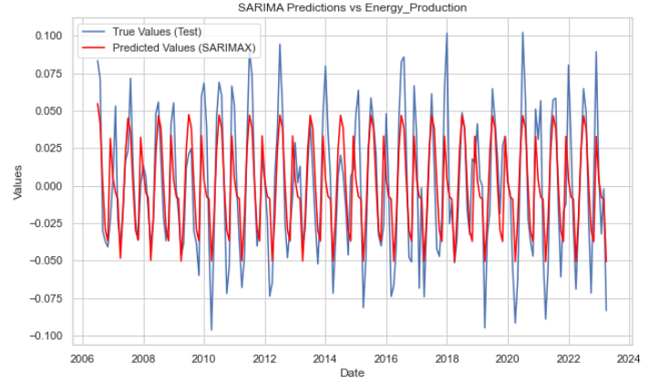
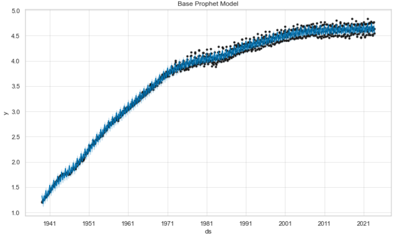
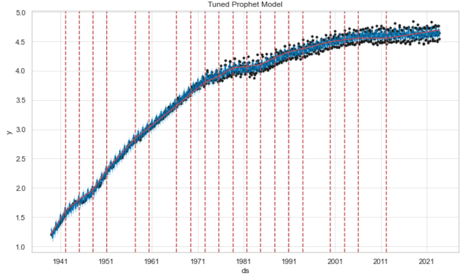
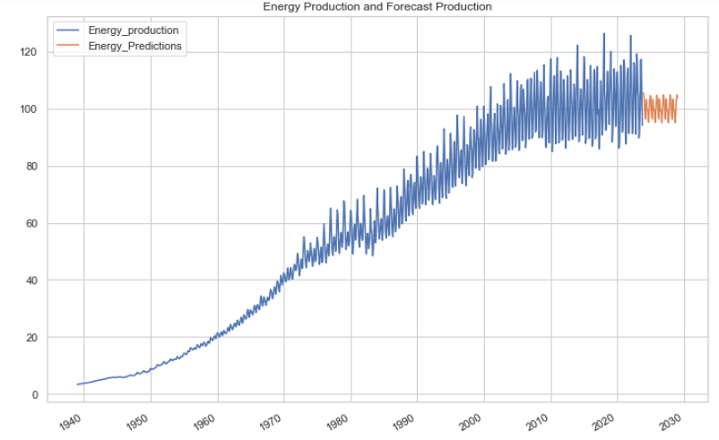

# dsc-project-phase-4

# Energy Production Forecasting
## Project Overview
The United States has a long and intricate history of energy production marked by technological advancements, environmental concerns, and a growing demand for reliable and sustainable energy sources.
Currently, the US energy mix is undergoing a significant transformation, with a growing share of renewable energy and natural gas, while coal's dominance is declining. This shift reflects the nation's commitment to decarbonization and the pursuit of cleaner energy sources. However, the challenge of producing enough energy to meet the demands of an ever-growing population remains.

This project aims to develop a time series forecasting model to predict energy production using a dataset of historical energy production data, along with relevant weather, economic, and regulatory factors.

## Business Understanding
Ensuring a consistent and reliable energy supply is paramount for sustaining the nation's economic stability and meeting the needs of its population.

As the U.S. transitions towards renewable energy sources, the phasing out of traditional energy sources might create a potential gap incapable of meeting the nation's energy demands. Ensuring a smooth transition necessitates a prediction model that accurately anticipates energy production, guaranteeing a balance between the declining traditional sources and the burgeoning renewable ones. Such a model becomes vital to prevent disruptions in energy supply, uphold stability, and sustainably meet the increasing energy needs during this pivotal shift in the energy landscape.

This study focuses on creating a dependable forecasting model for energy production. Accurate predictions empower efficient management of energy demand, aid in proper resource allocation and planning in line with production trends, and reduce costs associated with energy fluctuations.

## Data Understanding
This data was sourced from the Federal Reserve Economic Data (FRED) that contains frequently updated US macro and regional economic time series at annual, quarterly, monthly, weekly, and daily frequencies.
The data set contains 1018 entries for US monthly energy production from the years 1939-01-01 to 2023-10-01. These dataset has two columns, Date(monthly) and Energy production.

## Modeling

### PMDARIMA Model
PMDARIMA provides an auto_arima function that automatically selects the optimal ARIMA model for a given time series. The best-fitted SARIMA model is identified as ARIMA(0,1,2)(2,1,1,12). The model captures the temporal patterns and seasonality in the time series, making it a valuable tool for forecasting future values.

From the plot of predictions and actual values we see that the predicted values track the actual values closely, with only a few minor deviations. 

### Facebook Prophet
Facebook Prophet is a forecasting tool designed for time series data that exhibits patterns such as trends and seasonality. The flexibility to incorporate holidays, custom seasonality, and other factors makes it a powerful tool for a wide range of forecasting scenarios.

### Tuned Facebook Prophet
When tuning a Facebook Prophet model, the focus is on adjusting hyperparameters and optimizing the model for better forecasting performance. 

### Forecasting Future Energy Production
It appears that the model managed to capture some of the trend of energy production and short term fluctuations such as the seasonal peaks and valleys.

The model however appears to underestimate the uncertainty in the forecasts which may be as a result of insufficient data, or lack of other factors that influence energy production such as economic fluctuations.

## Conclusion
This study aimed to predict energy production trends, enabling a smooth transition towards renewable sources while emphasizing accurate forecasts in the face of shifting demand and supply dynamics.

Despite promising performance by the selected PMDARIMA model, the study also revealed limitations. The models demonstrated an underestimation of uncertainty in predicted values, suggesting potential gaps in accounting for diverse factors influencing energy production.

## Recommendation
1. Incorporating other factors - Factor in seasonal variations in weather.
2. Balancing Renewable Energy Reliability- The transition towards renewable energy sources demands a comprehensive approach.
3. Optimizing Infrastructure Management